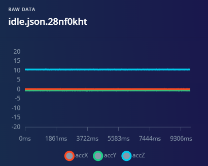
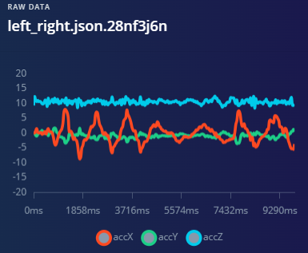
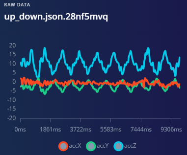
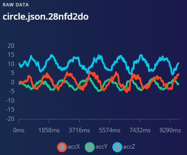
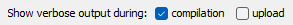

# ESP32 ADXL345 for Gesture Classification via TFLite Model in Arduino IDE:

ADXL345 has equivalent data representation as MPU6050, and therefore, we can adapt the model training, dataset and inference application between both sensors.

> Edge Impulse Project Link: https://studio.edgeimpulse.com/public/649039/live   **Attribution of credit: This project is adapted from [JoaoYukio's MPU6050 on ESP32 via TFLite & EdgeImpulse Repo](https://github.com/JoaoYukio/TinyML_GestureRecognition_Esp32) and reuses Joao Yukio's gesture dataset under GPLv3 license.** 

### Dataset Analysis within Jupyter Notebook (5 mins)

1. Run jupyter notebook / lab (e.g. Open an Anaconda Prompt -> `jupyter notebook`, to open at http://localhost:8888)

2. Open the `Analyse_ADXL345_Data.ipynb` to explore the classification dataset.

     - Note: the dataset of files are located within `ADXL_GestureDataset/` in directories `train` and `test`; and have been downloaded from Joao Yukio's EI project.

3. Firstly notice that Means / Std, Min / Max of class type.

4. In the EI Project you can visualize this as follows:

   | Idle                                                         | Left-Right                                                   | Up-Down                                                      | Circle                                                       |
   | ------------------------------------------------------------ | ------------------------------------------------------------ | ------------------------------------------------------------ | ------------------------------------------------------------ |
   |  |  |  |  |

5. The **range and sequence of values for each class** will need to **<u>match</u>** between your sensor and the dataset, in order to work correctly at **inference time**.

   1. > We **<u>must</u>** configure the sensor such that it's returned data is scaled similarly to match the trained model dataset.

   2. > *Note: **<u>Optionally</u>**, we can also add signal processing noise reduction techniques also. If we perform pre-processing steps on inference time sensor data, these <u>**must**</u> match the training dataset, if not the model will have incorrect (mismatched) data to infer with.*

### Model Code and Edge Impulse Project : (5 mins)
1. The exported model file uses a `Training using Raw Batch data`  approach in `ei-gesture_class_esp32_dataforwarder-arduino-1.0.7.zip` has the following specification:
   - TFLite format
   - Quantization Int8 model parameters.
   - Raw data input (no batch statistics)
   - Neural Network architecture: 360>20>10>4
     - Training parameters into EI's default model training procedure:
       - Train / Validation ratio: 80:20%
       - Batch size: 32
       - Weighted Classes (Inverse Proportional stratification or class examples)
       - Learning Rate: 0.0005 (Presumably this is ADAM optimizer, but requires confirmation).
       - Training epochs 30
2. Joao Yukio's project uses a `Training using Statistics of Batch data` approach to modelling, using EI's Spectral Features to model the behaviours at https://studio.edgeimpulse.com/public/36985/latest/
   - Note: The classification accuracy performance metric is higher in this approach than the `Raw Batch Data` modelling.
3. To retrain the model using a `Time Series representation`, then clone one of these projects, update the Data Preprocessing and Data Modelling stages, train/test then re-export. This approach will require a change of model type to a sequence-based model (such as RNN, LSTM, ConvLSTM, GRU, NHits, N-BEATS, or similar).

### Prepare for Uploading TFLite Model to ESP32 via Arduino IDE: (10 mins)
1. Set-up the board manager for ESP32 - [ESP32 Boards Manager install within Arduino IDE](https://docs.edgeimpulse.com/docs/run-inference/arduino-library/arduino-library-deprecated#boards-manager).
2. Install the attached ZIP file as an Arduino Library.
     1. `ei-gesture_class_esp32_dataforwarder-arduino-1.0.7.zip` into ArduinoIDE: i.e. `Sketch -> Include Library -> Include .ZIP Library`.
          
     2.  This will install unzip the directory onto the C++ compiler's build path for Arduino IDE.

### Upload Trial Code: (5+ mins)

Depending on your sensor , choose either the ADXL345 directories or the MPU6050. Start by testing the sensor data acquisition (V1), then testing the integrated classifier.

1. Open the file:  `ESP32_ADXL345_v1/` ino file

   1. > This should allow you to test without the EdgeImpulse or TFLite libraries (which can take 10-20 minutes to compile! Yes that's approximately correct!)

2. Before  compiling, install the relevant libraries.

   1. For the MPU6050 , you will need to install the latest `AdaFruit MPU6050 library` (via Manage Libraries). 
   2. For ADXL345, the `Wire.h` library is required. I believe this is provided by the `OneWire` library by Paul Stoffregen, however it might also be installed by default by Arduino IDE *(sorry, it's a long time since I set-up the IDE for Wire.h!)*.

3. Compile and upload to your ESP32. The Serial Monitor and Serial Plotter should help visualize the data acquisition, so you can compare these against dataset's `Idle` values and `Up-Down` values, etc.

   1. If the values are unmatched, then adjust the sensor's sensitivity configuration of values: for 2G, 4G, 8G, 16G. 
      1. The sensors' default range is (approx) -512 to 512. 
      2. The sensitivity values divide these values by a divisor, thus shrinking its value.
      3. Adjust as appropriate to match the expected dataset values.

### Upload Classifier Code: (30+ mins)

Now move to the sensor with integrated classifier code (V2). Firstly, the code will take along time to compile.  In File->Preferences-> Turn on  verbose outputs for compilation , to monitor its progress, to convince yourself that it is still working:

1. Open the file:  `ESP32_ADXL345_v2/` ino file
2. Adjust the sensitivity values according to your experience in `V1`.
3. Compile the file. The first time compiling will take a long time, due to size and number of linked files in the ESP Espressif, EdgeImpulse and TFLite libraries. The subsequent compilations will be much faster. (i.e. 15-20 minutes vs 1 minute)
4. Upload the binary to your Board.
5. Once it is uploaded, it is ready to play with and testing it for its Live Testing accuracy.
   1. This can be evaluated by performing each of the test cases, several times, and recording the classifier's decision and its Top-1 label percentage. 
   2. This technique for measurement allows you to generate the Confusion Matrix for the model's Live Test performance. The number of FP and FN per class can be counted, followed by calculation of Multi-class classification metrics.

As you'll know, this differs from "offline" model classification performance on a test set (or on a validation set). This is a test of the applied and integrated system. The "offline" performance is an isolated test of the model only. 

#### Three Sets Evaluation Results

Measuring the Applied and Integrated System leads to three sets of performance evaluation results:

1. Cross Validation model performance results (on validation set from dataset).
2. Test set model performance results (on test set from dataset).
3. Applied and Integrated System performance results (on newly collected data).
   1. There may be various test conditions to measure the system's `Robustness` to `Domain Shifts`, for example:
      1. Asking many people to perform the gestures - each person will perform the gestures slightly differently; is the classifier and integrated system robust to these differences?
      2. Fitted into different products - a sensor in a box vs a sensor attached to the wrist may orientate the sensor differently and have an effect on the prediction performance.

